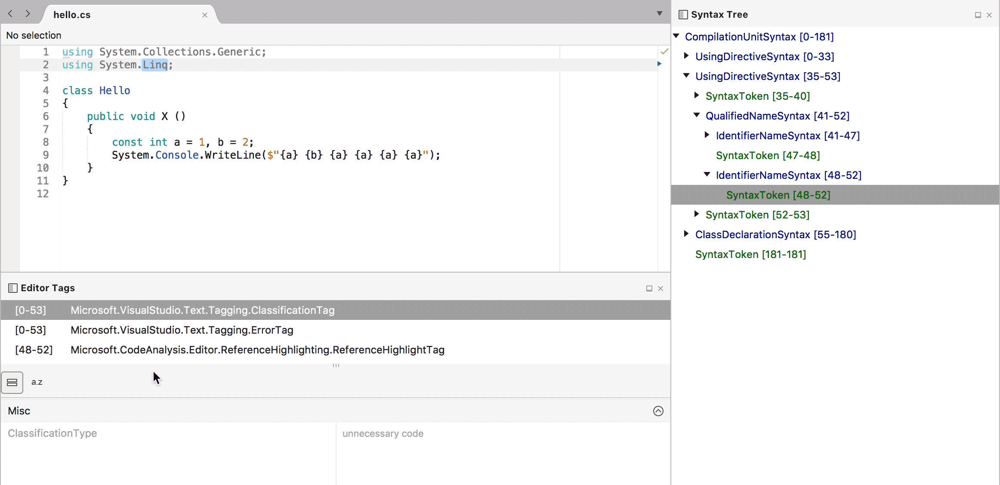

# MonoDevelop.AddinMaker

AddinMaker makes it easy to create and maintain Visual Studio for Mac and MonoDevelop extensions.

To get started with AddinMaker, please see [this guide](https://aka.ms/vs/mac/extend).

For more details, [check out the wiki](https://github.com/mhutch/MonoDevelop.AddinMaker/wiki).

## Features

* Full support for creating, building, running and debugging addins from within MD/XS.
* MSBuild-based build system is extensible and allows building from the commandline.
* Code completion for addin manifests, file templates and project templates.
* Automatically handles referencing core MD/XS assemblies and assemblies from referenced addins.
* The `AddinFile` build action takes care of the details of bundling files with the addin.
* Multi-targeting support allows building against any MD/XS instance.

### Syntax and Tags Visualizers

The **Syntax Tree** and **Editor Tags** pads can be found in the **View > Pads** menu.

The **Syntax Tree** pad shows a live view of the document's Roslyn syntax tree. Selecting a node in
the tree will select the corresponding node in the document, and moving the caret in the
document will select the closest node in the tree. This is useful for writing Roslyn
analyzers and fixes.

The **Editor Tags** pad shows the tags at the caret location in the editor. There's also
a property grid that shows the properties of the selected tag in the pad. This is useful
for developing classifiers or other taggers.

## Installation

Most users should install this from the Extension Gallery. However, if you wish to contribute to the addin, you will need to build it from source. This may also be necessary if you wish to use it with a prerelease version of MonoDevelop.

Because loading AddinMaker requires itself to be installed, scripts are provided to build and install it from the commandline. Simply run `Install.bat` (Windows) or `make install` (Mac, Linux).

To build against a specific version, you can provide arguments, e.g.

    make install ARGS="/p:MDBinDir=../monodevelop/main/build/bin /p:MDProfileVersion=7.0"
